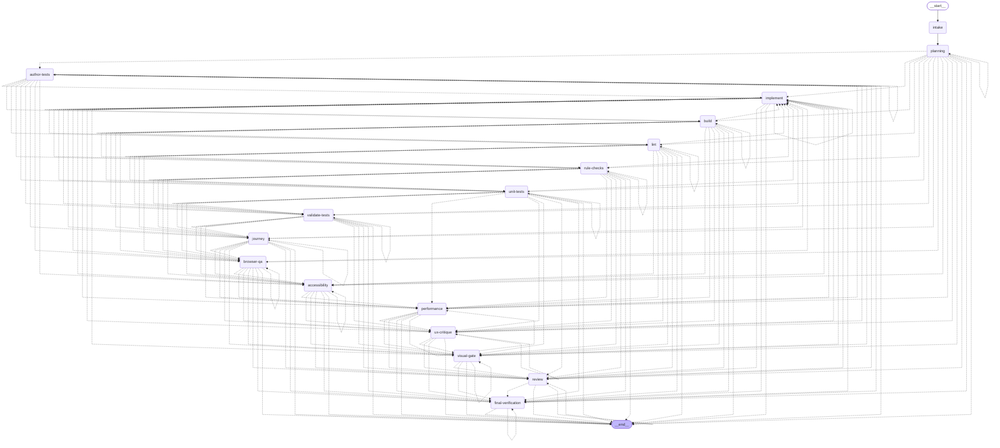

# Flow

The LangGraph graph, drawn from the code. Regenerate it after changing `langgraph/src/flow/graph.ts`.

```mermaid
%%{init: {'flowchart': {'curve': 'linear'}}}%%
graph TD;
	__start__([<p>__start__</p>]):::first
	intake(intake)
	planning(planning)
	author-tests(author-tests)
	implement(implement)
	build(build)
	lint(lint)
	rule-checks(rule-checks)
	unit-tests(unit-tests)
	validate-tests(validate-tests)
	journey(journey)
	browser-qa(browser-qa)
	accessibility(accessibility)
	performance(performance)
	ux-critique(ux-critique)
	visual-gate(visual-gate)
	review(review)
	final-verification(final-verification)
	__end__([<p>__end__</p>]):::last
	__start__ --> intake;
	intake --> planning;
	planning -.-> author-tests;
	planning -.-> implement;
	planning -.-> build;
	planning -.-> lint;
	planning -.-> rule-checks;
	planning -.-> unit-tests;
	planning -.-> validate-tests;
	planning -.-> journey;
	planning -.-> browser-qa;
	planning -.-> accessibility;
	planning -.-> performance;
	planning -.-> ux-critique;
	planning -.-> visual-gate;
	planning -.-> review;
	planning -.-> final-verification;
	planning -.-> __end__;
	author-tests -.-> implement;
	author-tests -.-> build;
	author-tests -.-> lint;
	author-tests -.-> rule-checks;
	author-tests -.-> unit-tests;
	author-tests -.-> validate-tests;
	author-tests -.-> journey;
	author-tests -.-> browser-qa;
	author-tests -.-> accessibility;
	author-tests -.-> performance;
	author-tests -.-> ux-critique;
	author-tests -.-> visual-gate;
	author-tests -.-> review;
	author-tests -.-> final-verification;
	author-tests -.-> __end__;
	implement -.-> build;
	implement -.-> lint;
	implement -.-> rule-checks;
	implement -.-> unit-tests;
	implement -.-> validate-tests;
	implement -.-> journey;
	implement -.-> browser-qa;
	implement -.-> accessibility;
	implement -.-> performance;
	implement -.-> ux-critique;
	implement -.-> visual-gate;
	implement -.-> review;
	implement -.-> final-verification;
	implement -.-> __end__;
	build -.-> implement;
	build -.-> lint;
	build -.-> rule-checks;
	build -.-> unit-tests;
	build -.-> validate-tests;
	build -.-> journey;
	build -.-> browser-qa;
	build -.-> accessibility;
	build -.-> performance;
	build -.-> ux-critique;
	build -.-> visual-gate;
	build -.-> review;
	build -.-> final-verification;
	build -.-> __end__;
	lint -.-> implement;
	lint -.-> rule-checks;
	lint -.-> unit-tests;
	lint -.-> validate-tests;
	lint -.-> journey;
	lint -.-> browser-qa;
	lint -.-> accessibility;
	lint -.-> performance;
	lint -.-> ux-critique;
	lint -.-> visual-gate;
	lint -.-> review;
	lint -.-> final-verification;
	lint -.-> __end__;
	rule-checks -.-> implement;
	rule-checks -.-> unit-tests;
	rule-checks -.-> validate-tests;
	rule-checks -.-> journey;
	rule-checks -.-> browser-qa;
	rule-checks -.-> accessibility;
	rule-checks -.-> performance;
	rule-checks -.-> ux-critique;
	rule-checks -.-> visual-gate;
	rule-checks -.-> review;
	rule-checks -.-> final-verification;
	rule-checks -.-> __end__;
	unit-tests -.-> implement;
	unit-tests -.-> validate-tests;
	unit-tests -.-> journey;
	unit-tests -.-> browser-qa;
	unit-tests -.-> accessibility;
	unit-tests -.-> performance;
	unit-tests -.-> ux-critique;
	unit-tests -.-> visual-gate;
	unit-tests -.-> review;
	unit-tests -.-> final-verification;
	unit-tests -.-> __end__;
	validate-tests -.-> implement;
	validate-tests -.-> journey;
	validate-tests -.-> browser-qa;
	validate-tests -.-> accessibility;
	validate-tests -.-> performance;
	validate-tests -.-> ux-critique;
	validate-tests -.-> visual-gate;
	validate-tests -.-> review;
	validate-tests -.-> final-verification;
	validate-tests -.-> __end__;
	journey -.-> implement;
	journey -.-> browser-qa;
	journey -.-> accessibility;
	journey -.-> performance;
	journey -.-> ux-critique;
	journey -.-> visual-gate;
	journey -.-> review;
	journey -.-> final-verification;
	journey -.-> __end__;
	browser-qa -.-> implement;
	browser-qa -.-> accessibility;
	browser-qa -.-> performance;
	browser-qa -.-> ux-critique;
	browser-qa -.-> visual-gate;
	browser-qa -.-> review;
	browser-qa -.-> final-verification;
	browser-qa -.-> __end__;
	accessibility -.-> implement;
	accessibility -.-> performance;
	accessibility -.-> ux-critique;
	accessibility -.-> visual-gate;
	accessibility -.-> review;
	accessibility -.-> final-verification;
	accessibility -.-> __end__;
	performance -.-> implement;
	performance -.-> ux-critique;
	performance -.-> visual-gate;
	performance -.-> review;
	performance -.-> final-verification;
	performance -.-> __end__;
	ux-critique -.-> implement;
	ux-critique -.-> visual-gate;
	ux-critique -.-> review;
	ux-critique -.-> final-verification;
	ux-critique -.-> __end__;
	visual-gate -.-> implement;
	visual-gate -.-> review;
	visual-gate -.-> final-verification;
	visual-gate -.-> __end__;
	review -.-> implement;
	review -.-> final-verification;
	review -.-> __end__;
	final-verification -.-> implement;
	final-verification -.-> __end__;
	planning -.-> planning;
	author-tests -.-> author-tests;
	implement -.-> implement;
	build -.-> build;
	lint -.-> lint;
	rule-checks -.-> rule-checks;
	unit-tests -.-> unit-tests;
	validate-tests -.-> validate-tests;
	journey -.-> journey;
	browser-qa -.-> browser-qa;
	accessibility -.-> accessibility;
	performance -.-> performance;
	ux-critique -.-> ux-critique;
	visual-gate -.-> visual-gate;
	review -.-> review;
	final-verification -.-> final-verification;
	classDef default fill:#f2f0ff,line-height:1.2;
	classDef first fill-opacity:0;
	classDef last fill:#bfb6fc;
```
